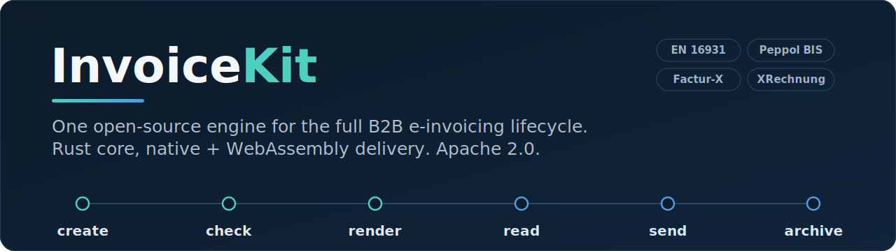

<p align="center">
  
</p>

<p align="center">
  <a href="LICENSE"></a>
  <a href="https://github.com/MuhDur/invoicekit/actions/workflows/ci.yml"></a>
  
  
  
</p>

> One toolkit for the full B2B invoicing lifecycle: generate, check, render, read, send, and store legally-correct e-invoices for Germany, France, Belgium, Italy, Poland, and the Peppol network. Runs on whatever stack you already use (Node, Python, Go, Java, .NET, browser, edge).

**Status: `v0.1.1` (first complete tagged release).** The Rust engine and ~110 workspace crates build green with a passing test suite (2000+ tests) and CI. `v0.1.1` is tagged on GitHub with cross-platform CLI binaries, the REST OpenAPI document, and a veraPDF-cleared PDF/A-3 gate; it is not yet published to a language package registry. Build from source (see [Installation](#installation)) or grab the release artifacts. APIs may still move before `1.0`. See [`CHANGELOG.md`](CHANGELOG.md).

## The problem

Every country in Europe, and most of the world, is rolling out mandatory electronic invoicing. Today every existing tool forces a tradeoff a developer should not have to make:

- Use Java, or it won't work.
- Sign up for a hosted service, give up control, and pay €15,000 a year minimum.
- Glue together five separate libraries and a Java sidecar to send one invoice.

## The solution

InvoiceKit replaces all of that with one open-source package. The compatibility contract is the engine API, the invoice data model, the rule packs, and the test fixtures, so the same logic runs as a native library on your server and as WebAssembly in the browser or at the edge.

| | Existing tools | InvoiceKit |
|---|---|---|
| Runtime | Java, or a hosted service | Node, Python, Go, Java, .NET, browser, edge, one engine |
| Cost to start | €0 to €15,000/year | €0, no signup |
| Coverage | One country or one format | Whole portfolio under one install |
| Reading invoices | Separate paid service | Built in, with field-level provenance |
| Audit trail | Do it yourself | Signed evidence bundle for every operation |
| License | Often locked or AGPL | Apache 2.0 |

## What it does

- **Writes** legally-correct invoices in every required format (Factur-X, ZUGFeRD, XRechnung, Peppol BIS, FatturaPA, KSeF FA(3), and more).
- **Checks** invoices against each country's rules with clear, explained error messages.
- **Renders** to PDF/A-3 with the machine-readable data embedded inside, byte-stable across runs.
- **Reads** invoices back from PDFs, scans, or XML and pulls out the structured data, with every extracted field carrying proof of where it came from.
- **Sends** invoices (optional, hosted) through Peppol and national gateways, with full delivery proof.
- **Archives** every operation as a signed, verifiable bundle that holds up in audit.

## Quick example

Once built, the `invoicekit` binary drives the lifecycle from the command line. Every example below maps to a real subcommand.

```sh
# Validate a UBL or CII invoice against the native EN 16931 rule set.
invoicekit validate invoice.xml

# Pin the rule pack to the law in force on a given date, and emit machine-readable findings.
invoicekit validate invoice.xml --date=2026-01-01 --json

# Get the ordered explain plan instead of a pass/fail summary.
invoicekit validate invoice.xml --explain

# Ask what InvoiceKit can actually do for a given sender/recipient pair.
invoicekit capabilities --from DE --to FR --format=json

# Verify a signed evidence bundle (exit 0 = pass, 1 = fail).
invoicekit verify operation.ikb

# Inspect a bundle's manifest and contents.
invoicekit show operation.ikb
```

Full subcommand list: `validate`, `pack`, `unpack`, `verify`, `show`, `diff`, `replay`, `timestamp`, `capabilities`, `peppol`, `init`, `doctor`, `repl`, `migrate-archive`, `codelist-update`, `version`.

## Design philosophy

These were settled after a multi-model review and are not casually overturned. The full list lives in [`AGENTS.md`](AGENTS.md).

1. **Rust core, dual delivery.** Native bindings for server runtimes, WebAssembly for browser and edge. Same engine, two delivery shapes.
2. **Money, tax, and code lists are first-class, and never floating-point.** Amounts are fixed-scale decimals at every API boundary. Code lists (ISO 3166, ISO 4217, VAT category, Peppol) are signed, versioned, effective-dated data.
3. **Rule packs are signed and versioned with effective dates.** No silent rule drift. `invoicekit validate --date=YYYY-MM-DD` selects the rule pack in force on that date.
4. **Reference validators run as an isolated JVM worker** (KoSIT, phive, Saxon) called over JSON-RPC. We do not embed Java in WebAssembly.
5. **Every operation produces a signed evidence bundle** (`.ikb`): canonical invoice JSON, generated XML, PDF, validation trace, rule-pack manifest, signatures, gateway receipts, and an RFC 3161 timestamp. Verification never executes shell scripts.
6. **Country coverage is honest.** A "supported" country carries an explicit maturity label per capability (serialize, validate, render, sandbox, live-delivery, inbound, archive, correction). There are no blanket "supported" claims; ask the binary with `invoicekit capabilities`.

The workspace forbids `unsafe_code` at the lint level. The single irreducible exception is the C ABI crate, where every site is documented and the foreign boundary is panic-guarded.

## Who it is for

Any developer who needs their software to issue or accept e-invoices in a country we cover:

- Accounting and billing tool builders.
- E-commerce platforms.
- Any business with a custom in-house billing system.
- Freelancers who want a clean script.
- AI agents that need to issue compliant invoices as part of their work.

No account needed. No per-invoice fee for the free core. Apache 2.0 forever.

## Installation

There is no published release yet, so install by building from source. You need a Rust toolchain (1.83 or newer) and, for the validation worker, a JVM.

```sh
git clone https://github.com/MuhDur/invoicekit.git
cd invoicekit

# Build the whole workspace.
cargo build --release --workspace

# The CLI lands at target/release/invoicekit.
./target/release/invoicekit version
```

The repository uses [`just`](https://github.com/casey/just) as its task runner:

```sh
just build      # cargo build --workspace --all-targets
just test       # cargo test --workspace
just lint       # cargo clippy --workspace --all-targets -- -D warnings
just ci         # the full local CI matrix in one shot
```

Native bindings (Node via napi-rs, Python via pyo3, .NET, Java via FFM, Go via cgo) and the browser/edge WebAssembly artifact build from the same engine; see [`bindings/`](bindings/). Package-registry distribution arrives with the first tagged release.

## Architecture

The engine is layered. A global commercial document sits at the root; profile views (EN 16931, Peppol BIS, XRechnung, Factur-X, FatturaPA, KSeF, ZATCA) project from it; typed jurisdiction extensions hang off the profiles. EN 16931 is the Year-1 European anchor, not the universal root for every country.

```
                 ┌───────────────────────────────────────────────┐
   create  ───▶  │  ir  →  canonical  →  format / profile crates  │
                 │   (layered model, byte-stable serialization)   │
                 └───────────────────────────────────────────────┘
                                     │
   check   ───▶  validate  ──▶  JVM validator worker (KoSIT / phive / Saxon, JSON-RPC)
   render  ───▶  render-pdf (Typst → PDF/A-3)  +  render-html
   read    ───▶  intake-pdf / intake-ocr / intake-vlm  (field-level provenance)
   send    ───▶  transmit-peppol (partner access point)  +  national report-* crates
   archive ───▶  evidence (.ikb bundle)  →  verify  →  archive (WORM storage)
```

Roughly sixty jurisdictions are covered in two ways. The ~35 countries that use European-style formats (Universal Business Language, Cross Industry Invoice, EN 16931, Peppol BIS/PINT, Factur-X, ZUGFeRD) come from the core engine. Countries with their own national format or government portal each get a dedicated `report-*` crate on top of the same engine: Germany, France, Italy, Poland, Spain, Saudi Arabia, India, Mexico, Brazil, Malaysia, Greece, Romania, Hungary, Turkey, and the rest of Latin America, Asia-Pacific, MENA, and Africa. The authoritative capability matrix lives in [`plans/PLAN.md`](plans/PLAN.md).

## What we deliberately don't do

- We do not file taxes.
- We do not run an accounting ledger.
- We do not process payments; we describe how an invoice should be paid, and the payment happens elsewhere.
- We do not replace ERPs; we feed them.
- We are not an end-user invoicing app. We are infrastructure for the developers who build those.

## Limitations

- **Pre-release.** Nothing is tagged or on a package registry. Build from source, and expect API movement before `0.1`.
- **Validation needs a JVM.** The reference validators run as an out-of-process Java worker. The pure-Rust EN 16931 checker covers the common rules, but the conformance-grade path calls the worker.
- **Live Peppol delivery is bring-your-own-credentials.** You hold the access-point certificate and endpoint; InvoiceKit drives the transmission. Native AS4 transport is a research track, not a Year-1 feature.
- **Coverage maturity varies by country.** Do not assume a country is fully supported because it is listed. Run `invoicekit capabilities --from <X> --to <Y>` for the real answer.
- **Right-to-left and CJK vertical scripts are reconstructed in the digital-PDF intake path.** Arabic and Hebrew lines are detected with the Unicode Bidirectional Algorithm and rebuilt into logical reading order; CJK vertical columns are read right-to-left, each column top-to-bottom. Two bounds remain: reconstruction works at show-text-run granularity (a multi-run embedded left-to-right phrase inside a right-to-left line keeps its place on the line but its runs land reversed among themselves), and a producer that bakes visual-order glyphs into each run instead of logical order is left to the OCR / vision fallback.

## FAQ

**Is this production-ready?** Not yet. It is pre-release and unversioned. The engine works and is tested, but treat it as a moving target until the first tag.

**Do I have to use Java?** Not for the engine, the bindings, or the WebAssembly build. The reference validators run as an isolated JVM worker you call over JSON-RPC, so Java stays out of your application process.

**How is money handled?** As fixed-scale decimals through the `invoicekit-money` crate. There is no floating-point arithmetic for monetary values anywhere in the stack.

**Why a signed evidence bundle for everything?** Because the value of an invoicing toolkit in a mandatory-e-invoicing world is proof. Every operation emits a `.ikb` bundle with the canonical data, the generated artifacts, the validation trace, signatures, and an RFC 3161 timestamp, and `invoicekit verify` checks it without running any shell scripts.

**Does it interoperate with `invopop/gobl`?** Yes. We read and write its JSON schema rather than reinventing it.

**Which formats can it write today?** UBL, Cross Industry Invoice, EN 16931, Peppol BIS/PINT, Factur-X, ZUGFeRD, and XRechnung from the core, with national `report-*` crates layered on top. Check the live matrix with `invoicekit capabilities`.

## Project background

InvoiceKit was scoped after a deep research pass covering 57 jurisdictions, 60+ existing tools, ~50 commercial competitors, ~490 candidate ideas, and adversarial reviews from multiple foundation models. The reasoning is open:

- [Master report](research/MASTER_REPORT.md): single-page executive summary of the whole effort.
- [Implementation plan](plans/PLAN.md): what we are building, how, and in what order.
- [Revisions log](plans/PLAN_v0.2_revisions.md): what changed after the first review round.
- [Research files](research/): every market-research stream, idea-generation phase, and adversarial critique.

## About Contributions

Please don't take this the wrong way, but I do not accept outside contributions for any of my projects. I simply don't have the mental bandwidth to review anything, and it's my name on the thing, so I'm responsible for any problems it causes; thus, the risk-reward is highly asymmetric from my perspective. I'd also have to worry about other "stakeholders," which seems unwise for tools I mostly make for myself for free. Feel free to submit issues, and even PRs if you want to illustrate a proposed fix, but know I won't merge them directly. Instead, I'll have Claude or Codex review submissions via `gh` and independently decide whether and how to address them. Bug reports in particular are welcome. Sorry if this offends, but I want to avoid wasted time and hurt feelings. I understand this isn't in sync with the prevailing open-source ethos that seeks community contributions, but it's the only way I can move at this velocity and keep my sanity.

For security issues, see [`SECURITY.md`](SECURITY.md) rather than filing a public issue.

## License

Apache 2.0. See [`LICENSE`](LICENSE).
